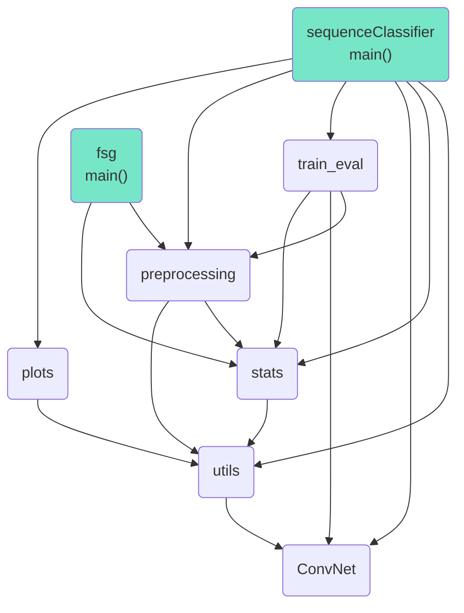

# Seqsharp - Sequence simulions

Project on the classification of simulated and empirical aligned protein sequences with a supervised learning approach. 

The performance of the supervised learning to distinguish empirical and simulated alignments shall serve as a metric to evaluate the realism of a sequence evolution simulator and thus to optimize the parameters used for its simulations. 

Furthermore a program is provided that allows to automatically simulate the sequence evolution, based on a set of given evolutionary trees as well as a set of empirical alignments which would also be the empirical input for the classification task. 
This program is independent from the sequence classification, meaning that any simulated sequences can be used for the classification.   

## The Sequence Classifier

### Install 

A minimum python version of 3.6 is required to run the program. Install all required python modules as follows:  
``` 
python -m pip install --upgrade pip
pip install -r requirements.txt 
```

### Usage

To run the script use:

`python sequenceClassifier.py [args]`

Type `python sequenceClassifier.py -h` obtain the output below for possible arguments:

```
usage: sequenceClassifier.py [-h] -d [DATASETS [DATASETS ...]] [-t] [--test] [-m MODELS] [--real]
                             [-c cfg] [-s SAVE] [--track_stats] [--shuffle] [--plot_stats]
                             [--pairs]

optional arguments:
  -h, --help            show this help message and exit
  -d [DATASETS [DATASETS ...]], --datasets [DATASETS [DATASETS ...]]
                        Specify the <path/to/> directory(s) containing alignments (in fasta format)
  -t, --training        Datasets will be used to train the neural network (specified with --datasets
                        option). Requires --cfg and --datasets.
  --test                Alignments will be passed to (a) trained model(s). Requires --models,
                        --datasets and --cfg
  -m MODELS, --models MODELS
                        <path/to> directory with trained model(s). These models will then be tested
                        on a given data set. --cfg, --datasets and --test are required for this
                        option.
  --real                Indicates that given data set has empirical alignments for --models option.
                        Otherwise they are assumed to be simulated
  -c cfg, --cfg cfg
                        <path/to> cfg file (.json) or directory containing: hyperparameters, data
                        specific parameters and parameters determining the structure of the Network.
                        If a directory is given, the latest modified json file will be used
  -s SAVE, --save SAVE  <path/to> directory where trained models and result plots will be saved
  --track_stats         Generate a csv file with information about the data e.g. the number of sites
                        and the training
  --shuffle             Shuffle the sites of alignments/pairs in the first directory specified
  --plot_stats          Generates histograms of number of sites and number of sequences of given
                        alignments (specified with --datasets)
  --pairs               A representation for each pair of sequences in an alignment will be used

```

Note that `--datasets` is required which might not be the case in a future version of the program. 

### Arguments explained

**`-d <str>`** example: `-d my/path/to/empirical/data my/path/to/simulated/data`

This argument specifies one or two paths to the directory(ies) containing fasta formatted files with multiple sequence alignments (MSAs) typically the first path should lead to the empirical MSAs while the second one should lead to the simulated alignments. Theses 2 data sets serve as an input for the supervised learning method. 
It is possible to indicate only one path if the `--models` and `--test` options are used. In that case the given data will be used as an input to the given model(s).

**`-t`**

This flag triggers the training of a Convolutional Neural Network (CNN) on the given data sets (specified by `-d`). It will carry out a binary classification task to distinguish real and simulated MSAs. Thereafter, the performance of the network will be plotted. Use `-s` to save the models and results in a folder.

**`--test`**

A test of (a) trained CNN(s) is performed in which a (single) data set, specified by `-d` is inputted into the CNN and its performance is subsequently printed.


**`-m <str>`** example: `-m my/path/to/my/trained/model(s)`

This argument can be used to specify a path to a file or directory. It can be either a `.pth` file or a directory containing one or more `.pth` files. These files should contain a trained CNN previously created with this program. 

**`--real`** 

In combination with `-d` only specifying one data set this flag indicates that the data set is composed of empirical alignments. Without this flag set the data is assumed to be simulated. This argument is necessary in order to correctly evaluate the predictions of the tested CNN. 

**`-c <str>`** example: `-c my/path/to/the/cfg/file.json`

An argument that specifies a path to a file or directory with a cfguration of parameters in a json format that must look like the example shown below. If a directory is specified, the last modified json file in that directory will be used. The parameters include hyperparameters for the optimization and input size of the CNN, parameters specifying the architecture of the network and parameters for preprocessing the data. In addition, a newly generated cfguration file is stored in the `-s` directory as well as in the `-c` directory, which contains the path of the models and results as well as the rest of the parameters of the input cfguration. After preprocessing the data some of these parameters might have been adjusted.

**`-s <str>`** example: `-s my/path/to/where/models/and/results/will/be/stored`

Plots (.png), eventually csv files and trained models (.pth) are saved in the directory specified with this argument. More specifically they will be stored in a newly generated folder starting with *cnn-* followed by a time stamp. 
According to other used arguments result plots could be plots showing the performance of each fold of a training (*fig-fold-[fold number].png*) as well as the overall accuracy and loss during the training (*folds_learning_curve.png*). For the `--plot_stats` flag histograms will be saved (*hist_n_seqs.png*, *hist_n_sites.png*). Moreover, the cfg file will be saved in *conig.json*. 

**`--track_stats`**

Information of the input data will be stored in a csv file (*`-s`-directory/alns_stats.csv*) using this flag. Including for each alignment its: id (filename), amino acid frequencies, number of padded sites, number of sequences, number of sites, average mean squared error (mse) to the other alignments in the data set, maximum mse, minimum mse and if it is simulated or not.
In addition, in case of training a model, training specific information is stored in a file (*`-s`-directory/aln_train_eval.csv*) containing: the fold number, the alignment ID, the accuracy (whether the alignment was correctly classified or not), whether or not it belonged to the validation data set, the average, minimum and maximum mse to the training data set, on the one hand to simulated and real MSAs on the other hand only to real MSAs if the MSA is empirical, respectively only to simulated MSAs if the MSA is simulated. 

**`--shuffle`**

This flag causes the sites (columns) of the alignments specified in the first path with `-d` to be shuffled. The data in the specified path is not changed. The mixed alignments are used only when testing or training a model. 

**`--plot_stats`**

Calculation of the number of sites of the alignments in the given data sets as well as the number of sequences per alignment. Histograms are generated from these data, also showing their 0.25, 0.5 and 0.75 quantiles. These graphs are stored in the `-s` directory.

**`--pairs`**

This flag indicates that an alignment is represented by every possible pair of its sequences. Where one pair serves as one training example for the model. Please note that this will result in a large set of training examples. If this flag is not set, an alignment is represented by its amino acid frequencies for each site. 


### Running the program: examples

Open a terminal and make sure you are in the project folder:

`cd path/to/mlaa`

Train a model to distinguish real and simulated data:

`python sequenceClassifier.py -d data/fasta_real data/fasta_sim -t -c cfgs/cfg.json
`

Use a train model to test it on empirical data: 

` python sequenceClassifier.py -d data/fasta_real --test -c results/cnn-example/cfg.json -m results/cnn-example
`

Train a model and save it and its performance plots:

`python sequenceClassifier.py -d data/fasta_real data/fasta_sim -t -c cfgs -s results/example
`

Train a model, additionally saving information about the data and the training in csv files:

`python sequenceClassifier.py -d data/fasta_real data/fasta_sim -t -c cfgs -s results/example --track_stats
`

Plot the distribution of the number of sites and the number of sequences per alignment: 

`python3 sequenceClassifier.py -d data/fasta_real data/fasta_sim --plot_stats -c cfgs -s results/example
`

### cfg.json

an example `cfg.json` file looks like this:

```
{
    "data": 
    {
        "n_alignments": 2500, 
        "min_seqs_per_align": 4, 
        "max_seqs_per_align": 1000, 
        "n_sites": 1000, "padding": "data"
    }, 
    
    "hyperparameters": 
    {
        "batch_size": 128, 
        "epochs": 20, 
        "lr": 0.01, 
        "optimizer": "Adagrad", 
        "n_folds": 10
    }, 
        
    "conv_net_parameters": 
    {
        "n_conv_layer": 2, 
        "n_lin_layer": 1, 
        "kernel_size": 5, 
        "do_maxpool": 1
    }, 
    
    "results_path": "", 
    "comments": "This is an example cfguration"
}
```
Note that you do not have to specify the batch size and the learning rate. In this case, enter `""` instead of a value. Consequently, the following batch sizes are used: `32, 64, 128, 256, 512`. The learning rates in that case are: `0.1, 0.01, 0.001, 0.0001`. All batch sizes and learning rates are combined and used for different trainings. In the end, only the results and models of the training with the best validation accuracy are stored. 
If you want to use your own parameter spaces, you can specify them like this:

``` 
"batch_size": [128, 64]  
"lr": [0.01, 0.0001]  
```

### Results

When training a model the printed output before and during the learning process looks like this:

```
Loading alignments ...
Generating alignment representations ...
Preloaded data uses : 8e-08GB


Compute device: cuda:0

FOLD 1
----------------------------------------------------------------
Building training and validation data set ...
Finished after 0.1s

Epoch [0], loss: 0.693507194519043, acc: 0.5
Epoch [1]
Training: Loss: 0.6885, Acc.: 0.6788
Validation: Loss: 0.6892, Acc.: 0.6627
Epoch [2]
Training: Loss: 0.6905, Acc.: 0.6863
Validation: Loss: 0.691, Acc.: 0.6468
Epoch [3]
Training: Loss: 0.6914, Acc.: 0.7155
Validation: Loss: 0.6917, Acc.: 0.6786

( ... )
```

For testing a trained network you can expect an output like this: 

```
Loading alignments ...
Only 2690 / 5517 fasta files taken into account.
Generating alignment representations ...
Building validation data set ...

model 1, accuracy: 0.1524(0.9701)
model 2, accuracy: 0.1323(0.9782)
model 3, accuracy: 0.171(0.981)
model 4, accuracy: 0.1743(0.9691)
model 5, accuracy: 0.1335(0.9746)
model 6, accuracy: 0.0996(0.9583)
model 7, accuracy: 0.1197(0.9664)
model 8, accuracy: 0.0963(0.9774)
model 9, accuracy: 0.0349(0.9783)
model 10, accuracy: 0.1435(0.9665)

Average: 0.1258, Standard deviation: 0.0392
Average acc. after training: 0.972, Standard deviation: 0.0067
```


## Formatting and Simulations Generator (fsg)

### Usage

In order to generate simulations, please download the Seq-Gen simulator from [here](http://tree.bio.ed.ac.uk/software/seqgen/)

To run the script use:

`python fsg.py [args]`

Type `python fsg.py -h` obtain the output below for possible arguments:

```
usage: fsg.py [-h] [-f] [--ocaml] [-s simulator path hogenom fasta path] [-r] [-n min number of sequences max number of sequences] [-a NUMBERALIGNS] indir outdir

positional arguments:
  indir                 the </path/to/> input directory or file
  outdir                the </path/to/> output directory or file

optional arguments:
  -h, --help            show this help message and exit
  -f, --format          format newick trees such that they can be passed to the simulator. Per default files are formatted for the Seq-Gen simulator. Use --ocaml to format for the ocaml-simulator
  --ocaml               Indicate reformatting for simulations with the ocaml-simulator
  -s simulator path hogenom fasta path, --simulator simulator path hogenom fasta path
                        simulate sequences from newick trees. Requires </path/to/> seq-gen or ocaml-sim executable.
  -r, --removegaps      remove column(s) with gap(s) from input fasta file or directory and save alignment(s) without gaps in given output file or directory

arguments for simulation:
  -n min number of sequences max number of sequences, --numberseqs min number of sequences max number of sequences
                        2 integers determining minimum/maximum number of sequences to be simulated per alignmnet default: (4,300)
  -a NUMBERALIGNS, --numberaligns NUMBERALIGNS
                        the number of alignments to be simulated
```

### Arguments explained 

**`indir <str>`** example: `my/path/to/input/data`

The input folder can contain newick trees (.ph), newick trees especially reformatted for Seq-Gen (.tree) or fasta files.

**`outdir <str>`** example: `my/path/to/output/directory`                
    
Specify the directory where formatted trees or fasta files or simulated alignments should be stored.

**`-f`**

Flag indicating that you want to reformat newick trees for a simulator. Per default given trees are reformatted in order to be passed to the Seq-Gen simulator. In that case, if the first node is terminal, then the first non-terminal node will be exchanged with the terminal one. Furthermore, confidence values will be removed form the trees.   

**`--ocaml`**

This flag indicates that trees should be formatted to perform simulations with the ocaml-simulator. If so, only confidence values will be deleted from the tree. 


**`-s <str> <str>`** example: `-s my/path/to/Seq-Gen/source/seq-gen my/path/to/empirical/fastas`

The first path needs to be the directory to [the `seq-gen` program](http://tree.bio.ed.ac.uk/software/seqgen/) or the [ocaml-executable `_build/default/simulator.exe`](https://gitlab.in2p3.fr/pveber/mlaa/-/tree/indel-simulator/ocaml) , while the second directory has to contain fasta formatted sequence alignment. The simulations with Seq-Gen will be based on the amino acid frequency and number of sites of these MSAs.  
While the ocaml-simulator uses a given rate matrix and a set of amino acid profiles. The files need to be named: [`wag.dat`](https://www.ebi.ac.uk/goldman-srv/WAG/wag.dat) and [`263SelectedProfiles.tsv`](https://gitlab.in2p3.fr/pveber/codepi/-/blob/master/example/aa_fitness/263SelectedProfiles.tsv) and need to be in the partent folder of the parent folder of the ocaml-executable (in `exe-folder/../..`). The insertion and deletion rate for the simulations are currently set to zero. 

**`-n` <int> <int>** example: `-n 3 1000`

Minimum and maximum number of sequences for each simulated alignment. The default values are 4 and 300. 

**`-a` <int>** example: `-a 300`

Argument to specify the desired number of simulations (alignments).

**`-r`**

Flag indicating that gaps and indels (`'-'`) shall be removed from inputted fasta files. Note that the directory for the alignments has to be given by the positional argument `indir`.

### The generation of simulations: Walk Through

1. Reformat your newick trees so that they are accepted by Seq-Gen:

`python fsg.py data/hogenom_trees data/seq_gen_input_trees -f
`

2. Remove gaps/indels from the empirical alignments:

`python fsg.py data/fasta_real_gaps_indels data/fasta_real_no_gaps_indels -r
`

3. Run the simulations:

` python3 fsg.py data/seq_gen_input_trees data/simulations -s ../../Seq-Gen/source/seq-gen data/fasta_real_no_gaps_indels -a 99 -n 3 1000
`

Note that you need to replace `../../Seq-Gen/source/seq-gen` with your path to the simulator.

## Organisation of scripts

The following diagram illustrates the dependencies between scripts.




