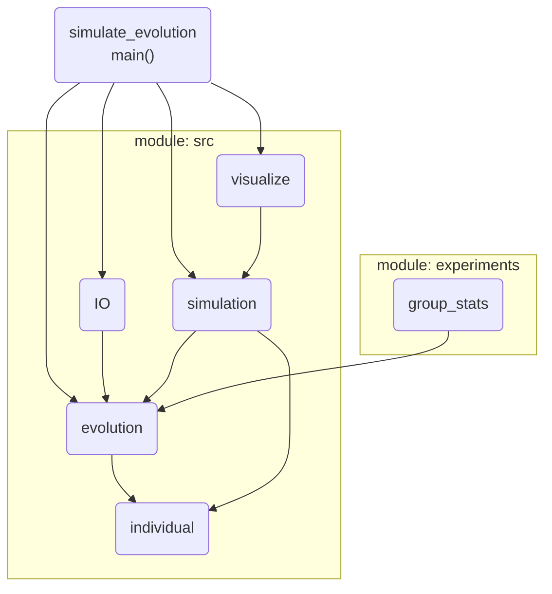

# Assesing the realism of biological sequence evolution simulations

Project on the classification of simulated and empirical aligned protein sequences with a supervied learning approach. 

The performance of the supervised learning to distinguish empirical and simulated alignments shall serve as a metric to evaluate the realism of a sequence evolution simulator and thus to optimize the parameters used for its simulations. 

Furthermore a program is provided that allows to automatically simulate the sequence evolution using the simulator Seq-Gen, based on a set of given evolutionary trees as well as a set of empirical alignments which would also be the emirical input for the classification task. 
This program is independent from the sequence classification, meaning that any simulated sequences can be used for the classification.   

## The Sequence Classifier

### Install 

A minimum python version of 3.6 is required to run the program. Install all required python modules as follows:  
``` 
python -m pip install --upgrade pip
pip install -r requirements.txt 
```

### Documentation

After cloning the repository to your local machine, you can open the documentation from here: `doc/_build/html/index.html`


### Usage

To run the script use:

`python sequenceClassifier.py [args]`

Type `python sequenceClassifier.py -h` obtain the output below for possible arguments:

```
usage: sequenceClassifier.py [-h] -d [DATASETS [DATASETS ...]] [-t] [--test] [-m MODELS] [--real]
                             [-c CONFIG] [-s SAVE] [--track_stats] [--shuffle] [--plot_stats]
                             [--pairs]

optional arguments:
  -h, --help            show this help message and exit
  -d [DATASETS [DATASETS ...]], --datasets [DATASETS [DATASETS ...]]
                        Specify the <path/to/> directory(s) containing alignments (in fasta format)
  -t, --training        Datasets will be used to train the neural network (specified with --datasets
                        option). Requires --config and --datasets.
  --test                Alignments will be passed to (a) trained model(s). Requires --models,
                        --datasets and --config
  -m MODELS, --models MODELS
                        <path/to> directory with trained model(s). These models will then be tested
                        on a given data set. --config, --datasets and --test are required for this
                        option.
  --real                Indicates that given data set has empirical alignments for --models option.
                        Otherwise they are assumed to be simulated
  -c CONFIG, --config CONFIG
                        <path/to> config file (.json) or directory containing: hyperparameters, data
                        specific parameters and parameters determinin the structure of the Network.
                        If a directory is given, the latest modified json file will be used
  -s SAVE, --save SAVE  <path/to> directory where trained models and result plots will be saved
  --track_stats         Generate a csv file with information about the data e.g. the number of sites
                        and the training
  --shuffle             Shuffle the sites of alignments/pairs in the first directory specified
  --plot_stats          Generates histograms of number of sites and number of sequences of given
                        alignments (specified with --datasets)
  --pairs               A representation for each pair of sequences in an alignment will be used

```

Note that `--datasets` is required which might not be the case in a future version of the program. 

### Arguments explained

**`-d <str>`** example: `-d my/path/to/empirical/data my/path/to/simulated/data`

This argument specifies one or two paths to the directory(ies) containing fasta formated files with multiple sequence alignments (MSAs) typically the first path should lead to the emirical MSAs while the second one should lead to the simulated alignments. Theses 2 data sets serve as an input for the supervised learning method. 
It is possible to indicate only one path if the `--models` and `--test` options are used. In that case the given data will be used as an input to the given model(s).

**`-t`**

This flag triggers the training of a Convolutional Neural Network (CNN) on the given data sets (specified by `-d`). It will carry out a binary classification task to distinguish real and simulated MSAs. Thereafter, the performance of the network will be plotted. Use `-s` to save the models and results in a folder.

**`--test`**

A test of (a) trained CNN(s) is performed in which a (single) data set, specified by `-d` is inputted into the CNN and its performance is subsequently printed.


**`-m <str>`** example: `-d my/path/to/my/trained/model(s)`

This argument can be used to specify a path to a file or directory. It can be either a `.pth` file or a directory containing one or more `.pth` files. These files should contain a trained CNN previously created with this program. 

**`--real`** 

In combination with `-d` only specifying one data set this flag indicates that the data set is composed of empirical alignments. Without this flag set the data is assumed to be simulated. This argument is necessary in order to correctly evaluate the predictions of the tested CNN. 

**`-c <str>`** example: `-d my/path/to/the/config/file.json`

An argument that specifies a path to a file or directory with a configuration of parameters in a json format that must look like the example shown below. If a directory is specified, the last modified json file in that directory will be used. The parameters include hyperparameters for the optimization and input size of the CNN, parameters specifying the architecture of the network and parameters for preprocessing the data. In addition, a newly generated configuration file is stored in the `-s` directory as well as in the `-c` directory, which contains the path of the models and results as well as the rest of the parameters of the input configuration. After preprocessing the data some of these parameters might have been adjusted.

**`-s <str>`** example: `-d my/path/to/where/models/and/results/will/be/stored`

Plots (.png), eventually csv files and trained models (.pth) are saved in the directory specified with this argument. More specifically they will be stored in a newly generated folder starting with *cnn-* followed by a time stamp. 
According to other used arguments result plots could be plots showing the performance of each fold of a training (*fig-fold-[fold number].png*) as well as the overall accuracy and loss during the training (*fig-fold-eval.png*). For the `--plot_stats` flag historams will be saved (*hist_nb_seqs.png*, *hist_nb_sites.png*). Moreover, the config file will be saved in *conig.json*. 

**`--track_stats`**

Information of the input data will be stored in a csv file (*`-s`-directory/alns_stats.csv*) using this flag. Including for each alignment its: id (filename), amino acid frequencies, number of padded sites, number of sequences, number of sites, average mean squared error (mse) to the other alignments in the data set, maximum mse, minimum mse and if it is simulated or not.
In addition, in case of training a model, training specific information is stored in a file (*`-s`-directory/aln_train_eval.csv*) containing: the fold number, the alignment ID, the accuracy (whether the alignment was correctly classified or not), whether or not it belonged to the validation data set, the average, minimum and maximum mse to the training data set, on the one hand to simulated and real MSAs on the other hand only to real MSAs if the MSA is empirical, respectively only to simulated MSAs if the MSA is simulated. 

**`--shuffle`**

This flag causes the sites (columns) of the alignments specified in the first path with `-d` to be shuffled. The data in the specified path is not changed. The mixed alignments are used only when testing or training a model. 

**`--plot_stats`**

Calculation of the number of sites of the alignments in the given data sets as well as the number of sequences per alignment. Histograms are generated from these data, also showing their 0.25, 0.5 and 0.75 quantiles. These graphs are stored in the `-s` directory.

**`--pairs`**

This flag indicates that an alignment is represented by every possible pair of its sequences. Where one pair serves as one training example for the model. Please note that this will result in a large set of training examples. If this flag is not set, an alignment is represented by its amino acid frequencies for each site. 


### Running the program: examples

Open a terminal and make sure you are in the project folder:

`cd path/to/mlaa`

Train a model to distinguish real and simulated data:

`python sequenceClassifier.py -d data/fasta_real data/fasta_sim -t -c configs/config.json
`

Train a model and save it and its performance plots:

`python sequenceClassifier.py -d data/fasta_real data/fasta_sim -t -c configs -s results
`


### Results

For each evolution a `evo_config.json` file is used to store main parameters of the evolution. Furthermore, a `stats.csv` and `fitness.csv` file store basic statistics such as average fitness and fitness per generation and individuals. A `tracker.pkl` file is requested storing the paths of each individual for each simulation. Supress requested tracker file by adding `-nt` to the simulation command. 

The script `experiments/group_stats.py` shows plots for experiments with different mutation rates once using symmetic and once non-symmetric individuals each experiment having 30 trials. It shows a box plot for the last generation of all experiments once in normal size and once "zoomed in" to be able to read all results properly. Furthermore, one will see 2 plots containing the average performance over all generations one for the experiments with symmety and the other one for the experiments without symmetry.  

### evo_config.json

an example `evo_config.json` file looks like this:

```
{
"individuals": 
    {
    "min_box_size": 0.3,              -> minimum half size of initial randomly created boxes
    "max_box_size": 1.0,              -> maximum half size of initial randomly created boxes
    "random_box_size": true,          -> use random boxes - if false, the average of the above is used as fixed size
    "symmetric": false,               -> whether the individual is symmetric with respect to the sizes of it's limbs 
    "min_force": 100,                 -> minimum force per limb
    "max_force": 500,                 -> maximum force per limb
    "start_move_pattern_size": 240,   -> size of the initial moving pattern (at 240 fps, this corresponds to 1s of steps)
    "vary_pattern_length": true,      -> whether to vary the length of the motion pattern by evolution
    "normalize_move_pattern": false,  -> whether to normalize the move pattern such that all step sizes sum up to 2 pi
    "standard_volume": 2.197          -> scales the mass to be at 1 if the cube is shaped 1.3^3 (default half size * 2)
    }, 
"simulation": 
    {
    "fps": 240,                       -> update simulations so many times per second
    "colormap": "viridis",            -> color scheme for individuals that are rendered (randomly chosen from colormap)
    "generations": 200,               -> number of generations to be evolved
    "individuals": 80,                -> number of individuals per generation
    "duration": 40                    -> duration of the simulation for each individual in seconds
    }, 
"evolution": 
    {
    "mutation_prob_ind": 0.05,        -> probability for an individual to mutate
    "mutation_prob_gene": 0.05,       -> probability for a gene to mutate
    "mutation_prob_feature": 0.05,    -> probability for a feature of that gene to mutate
    "alpha_limits": 0.5               -> alpha value for computing limits for choosing the value after crossing
    }
}
```
## Organisation of scripts




### individual

##### sizes
All individuals consist of 6 boxes and 6 spheres (actually 11 spheres since 2 spheres overlap at each connection gutted the head). Boxes are: chest, hip, left / right arm and left / right leg. Spheres are: head, waist, left / right shoulder and left / right hip joint.

Each box is initialized such, that the mass (on average) per box is 1. This is due to the fact that the half-size of each box is a random value between 0.3 and 1.0 (for the default settings), which on average is 0.65. Since this value defines the half-size each box is on average shaped 1.3 * 1.3 * 1.3 and thus has a standard volume of 2.197 which corresponds to mass of one. If values are changed, consider adapting the standard mass.

##### forces
To each sphere (except the head) a force is added, moving the limb in x and / or z direction. The force is depending on the mass, but capped. It is computed according to this formula:

`1 / (1 / max_force + np.exp(-mass * 3)) + min_force`

which creates a sigmoid function f such that force = f(mass) between min_force and max_force. Hence there is an optimal range were the best volume - force tradeoff is achieved, preventing boxes from getting too small and too big.

##### moving pattern
Each limb has an assigned movment pattern. Its array values are called sequentially one for each simulation step. If the end of the pattern is reached, it will repeat.

If requested the movement pattern can be normalized to (e.g.) 2 pi. This would make the sum of all step sizes (absolute values) in the pattern be of 2 pi. Hence it is ensured, that no more than one "round" of a circle can be made per cycle.

### evolution

main functionalities of this script are: 

##### fitness
The fintess is computed as the L2 norm between [0, 0] and the coordinate of any individual at the last time step of the simulation. Note that the z coordinate is ignored.

##### selection
For selecting individuals to carry their genome to the next generation, the fitness is ranked descending, and individuals are selected based on "Concepts fondamentaux des algorithmes évolutionnistes" by Jean-Baptiste Mouret. Once individuals that are allowed to carry their genes over to the next generation are selected, as many pairs as there were individuals in the original population are formed. Thereby individuals are combined randomly with other individuals, ensuring that every individual has been chosen at least once.

##### crossing
Crossing is performed gene wise. For each pair of values a random value is selected between the limits [o - d / 2 - a * d, o + d / 2 + a * d], where "o" is the average of the value pairs, "d" the absolute difference and "a" a value to enlarge the search space linearly (in the default case a = 0.5). Thus a random r value would be selected such that o - d / 2 - d * a < r < o + d / 2 + a * d. This procedure is repeated for every value- pair across the parent genomes. Afterwards mutation is applied with a certain probability.

##### mutation
Mutation is realized as a random re-initialization of certain features of the genome. Thereby 3 different probabilities can be tuned. 1) the probability that the inidivual mutates at all, 2) the probability that a certain gene mutates (e.g. size of the left hand) and 3) the probability for a certain feature to mutate (e.g. the y size of the left hand).

### IO

* manages the user input e. g. generation of a jason configuration file 
* can generate, read or load a jason configuration file
* can save or load the output of an evolution like the fitness for each individual 

### simulation 

* sets up the physics simulation and simulates all individuals 
* handels multi-core processing for windows and unix io systems

### visualize 

* can render a GUI based simulation for selected individuals
* can be used to show a plot of the average and best performance of eah generation during an evolution
* shows the path that an individual or multiple individuals have traveled in a plot if requested 

### group_stats

* shows all plots that can be generated from experiments that have been executed on a cluster 
